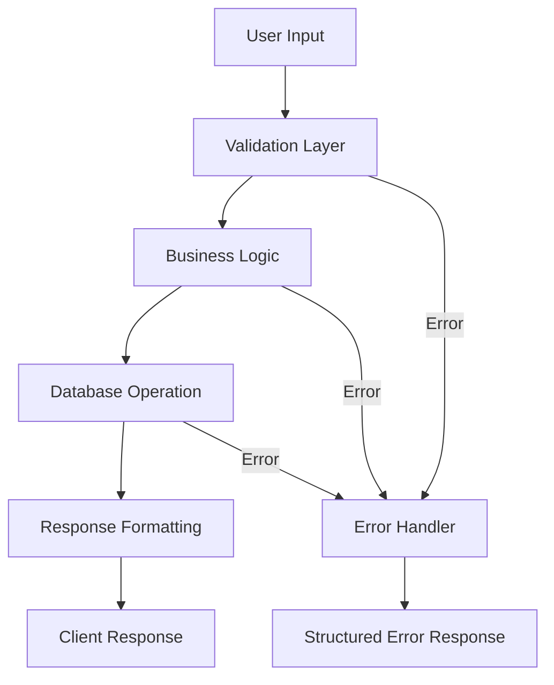

# **Production Code Generator - AI Development Guide**

---

## **📋 Document Overview**

**Purpose**: AI システム（Claude）が production-ready code を生成するための包括的な指示書  
**Version**: 2.0  
**Last Updated**: 2025-08-23  
**Language**: Japanese with English technical terms  
**Scope**: Enterprise-grade web application development

---

## **🎯 Core Mission**

> **即座にデプロイ可能な、エンタープライズグレードの品質を持つコードを生成する**

### **Primary Objectives**

1. **Production-Ready**: デプロイ可能な完全なコード
2. **Enterprise-Grade**: セキュリティ、スケーラビリティ、保守性を考慮
3. **Best Practices**: 業界標準とベストプラクティスに準拠
4. **Complete Solution**: 部分的な解決ではなく、完全な実装

---

## **🛠 Technology Stack**

### **Frontend**

- **Framework**: React 18+ with TypeScript 5+
- **Build Tool**: Next.js 14+ (App Router)
- **Styling**: Tailwind CSS
- **State Management**: Context API / Zustand
- **Testing**: Jest, React Testing Library

### **Backend**

- **Runtime**: Node.js 20+ LTS
- **Framework**: Express.js
- **Type Safety**: TypeScript
- **Validation**: Zod / Joi
- **API Documentation**: OpenAPI/Swagger

### **Database**

- **Primary**: PostgreSQL 15+
- **Migrations**: node-pg-migrate
- **ORM**: Prisma / Drizzle (optional)
- **Caching**: Redis (when needed)

### **Infrastructure**

- **Container**: Docker
- **CI/CD**: GitHub Actions
- **Monitoring**: Structured logging (pino/winston)
- **Security**: Helmet, rate-limiting, CORS

---

## **🏗 Project Structure**

```
project-root/
├── src/
│   ├── components/     # React components (atomic design)
│   │   ├── atoms/
│   │   ├── molecules/
│   │   └── organisms/
│   ├── pages/          # Next.js pages
│   ├── api/            # API routes
│   │   ├── controllers/
│   │   ├── services/
│   │   ├── validators/
│   │   └── middleware/
│   ├── utils/          # Utility functions
│   ├── types/          # TypeScript definitions
│   ├── hooks/          # Custom React hooks
│   └── lib/            # External integrations
├── tests/
│   ├── unit/
│   ├── integration/
│   └── e2e/
├── migrations/         # Database migrations
├── docs/               # Documentation
│   └── openapi.yaml
├── .env.example        # Environment variables template
├── docker-compose.yml
└── README.md
```

---

## **💡 Code Generation Standards**

### **Naming Conventions**

```typescript
// Variables & Functions: camelCase
const userProfile = getUserProfile();

// React Components: PascalCase
const UserDashboard = () => {};

// Constants: UPPER_SNAKE_CASE
const MAX_RETRY_COUNT = 3;

// Files: kebab-case
// user-profile.service.ts

// Database: snake_case
// user_profiles (table)
// created_at (column)
```

### **Code Style**

- **Indentation**: 2 spaces (no tabs)
- **Line Length**: Max 100 characters
- **Quotes**: Single quotes for imports, double for JSX strings
- **Semicolons**: Always use
- **Trailing Commas**: Yes (for multi-line)

### **TypeScript Requirements**

```typescript
// ✅ Good: Explicit types
interface UserData {
  id: string;
  email: string;
  createdAt: Date;
}

const processUser = (user: UserData): ProcessedUser => {
  // Implementation
};

// ❌ Bad: Using 'any'
const processData = (data: any) => {};
```

---

## **🔍 Error Handling & Debugging Protocol**

### **1. Log Investigation (最優先)**

```typescript
// Structured logging with context
logger.error({
  message: "Payment processing failed",
  error: err.message,
  stack: err.stack,
  context: {
    userId: user.id,
    transactionId: transaction.id,
    timestamp: new Date().toISOString(),
  },
});
```

### **2. Root Cause Analysis**

**データフローを完全に把握してから修正を開始する：**



### **3. Comprehensive Error Handling**

```typescript
// Centralized error handler
class AppError extends Error {
  constructor(
    public statusCode: number,
    public message: string,
    public isOperational = true
  ) {
    super(message);
    Error.captureStackTrace(this, this.constructor);
  }
}

// Error middleware
const errorHandler: ErrorRequestHandler = (err, req, res, next) => {
  const { statusCode = 500, message = "Internal Server Error" } = err;

  logger.error({
    error: err.message,
    stack: err.stack,
    request: {
      method: req.method,
      url: req.url,
      body: req.body,
      userId: req.user?.id,
    },
  });

  res.status(statusCode).json({
    status: "error",
    statusCode,
    message:
      process.env.NODE_ENV === "production" ? "Something went wrong" : message,
    ...(process.env.NODE_ENV === "development" && { stack: err.stack }),
  });
};
```

### **4. Debug Strategy**

1. **Reproduce**: エラーを確実に再現
2. **Isolate**: 問題の範囲を特定
3. **Analyze**: データフロー全体を分析
4. **Fix**: 根本原因に対する修正
5. **Test**: 修正の検証と regression test
6. **Document**: 修正内容と理由を記録

---

## **📝 MANDATORY: TODO Creation Before Implementation**

### **CRITICAL: Always Create Detailed TODO List BEFORE Any Work**

Before writing ANY code or making ANY modifications, you MUST create a comprehensive TODO list that breaks down the entire task into atomic, actionable items.

### **TODO List Structure**

```markdown
## TODO List for [Task Name]

### Phase 1: Analysis & Planning

- [ ] Analyze current implementation
- [ ] Identify all affected components
- [ ] Document data flow from source to destination
- [ ] List all dependencies and imports
- [ ] Identify potential edge cases
- [ ] Create backup/rollback plan

### Phase 2: Core Implementation

- [ ] Create/modify data models
  - [ ] Define TypeScript interfaces
  - [ ] Update database schema if needed
  - [ ] Create migration files
- [ ] Implement business logic
  - [ ] Input validation
  - [ ] Core processing function
  - [ ] Error handling
  - [ ] Logging statements
- [ ] API endpoints
  - [ ] Route definition
  - [ ] Controller implementation
  - [ ] Middleware setup
  - [ ] Response formatting

### Phase 3: Frontend Changes

- [ ] Update/create React components
  - [ ] Component structure
  - [ ] Props interface
  - [ ] State management
  - [ ] Event handlers
- [ ] Styling updates
  - [ ] Tailwind classes
  - [ ] Responsive design
  - [ ] Accessibility attributes
- [ ] Form validation
  - [ ] Client-side validation
  - [ ] Error message display
  - [ ] Loading states

### Phase 4: Testing

- [ ] Unit tests
  - [ ] Service layer tests
  - [ ] Component tests
  - [ ] Utility function tests
- [ ] Integration tests
  - [ ] API endpoint tests
  - [ ] Database interaction tests
- [ ] E2E tests for critical paths
- [ ] Manual testing checklist

### Phase 5: Documentation & Cleanup

- [ ] Update API documentation
- [ ] Add code comments
- [ ] Update README if needed
- [ ] Remove debug code
- [ ] Optimize imports
- [ ] Check for unused variables

### Phase 6: Pre-deployment

- [ ] Run linter and fix issues
- [ ] Run security audit
- [ ] Performance testing
- [ ] Build verification
- [ ] Environment variable check
```

### **TODO Granularity Rules**

1. **Atomic Tasks**: Each TODO item should be completable in 15-30 minutes
2. **Measurable**: Each item should have a clear definition of "done"
3. **Sequential**: Order items by dependencies
4. **Specific**: No vague items like "fix bugs" - be specific about what to fix
5. **Checkable**: Each item should be independently verifiable

### **Example: Adding User Authentication**

```markdown
## TODO: Implement JWT Authentication

### Immediate Prerequisites

- [ ] Check if bcrypt is installed (if not, add to package.json)
- [ ] Check if jsonwebtoken is installed (if not, add to package.json)
- [ ] Verify PostgreSQL users table structure
- [ ] Create .env variables for JWT_SECRET and JWT_EXPIRY

### Database Layer

- [ ] Create users table migration with fields: id, email, password_hash, created_at, updated_at
- [ ] Create refresh_tokens table migration
- [ ] Run migration and verify table creation
- [ ] Create database indexes on email field

### Backend Implementation

- [ ] Create UserModel interface in types/user.ts
- [ ] Create auth.service.ts with methods:
  - [ ] hashPassword(password: string): Promise<string>
  - [ ] verifyPassword(password: string, hash: string): Promise<boolean>
  - [ ] generateTokens(userId: string): Promise<TokenPair>
  - [ ] verifyAccessToken(token: string): Promise<JWTPayload>
  - [ ] refreshTokens(refreshToken: string): Promise<TokenPair>
- [ ] Create auth.controller.ts with endpoints:
  - [ ] POST /api/auth/register
  - [ ] POST /api/auth/login
  - [ ] POST /api/auth/refresh
  - [ ] POST /api/auth/logout
- [ ] Create auth.middleware.ts for protected routes
- [ ] Add validation schemas using Zod
- [ ] Add rate limiting to auth endpoints
- [ ] Add comprehensive error handling for each endpoint

### Testing Implementation

- [ ] Write unit tests for auth.service.ts (minimum 90% coverage)
- [ ] Write integration tests for all auth endpoints
- [ ] Test edge cases:
  - [ ] Invalid email format
  - [ ] Weak password
  - [ ] Duplicate email registration
  - [ ] Expired tokens
  - [ ] Invalid tokens
  - [ ] Rate limiting

### Documentation

- [ ] Update OpenAPI spec with auth endpoints
- [ ] Document authentication flow in README
- [ ] Add example requests to API documentation
- [ ] Create migration guide for existing users
```

### **Progressive TODO Refinement**

As you work through the TODO list:

1. **Check off completed items** using [x]
2. **Add new discovered subtasks** as you uncover complexity
3. **Document blockers** with 🚫 emoji and reason
4. **Mark critical path items** with 🔴 emoji
5. **Update time estimates** if tasks take longer than expected

### **TODO Anti-patterns to Avoid**

❌ **DON'T**:

- Create vague items: "Handle errors"
- Bundle multiple tasks: "Create API and tests"
- Skip edge cases: "Add validation (happy path only)"
- Ignore dependencies: Starting frontend before API is ready

✅ **DO**:

- Be specific: "Add try-catch to getUserById with custom error message"
- Keep atomic: "Create POST /api/users endpoint" (separate from tests)
- Include edge cases: "Validate email format", "Check for duplicate emails"
- Respect dependencies: Complete API before frontend integration

---

## **🧠 MANDATORY: Thinking Process**

### **Step 1: Requirement Analysis**

- **Explicit Requirements**: 明示的に要求されていること
- **Implicit Requirements**: 暗黙的に必要なこと
- **Constraints**: 制約事項
- **Success Criteria**: 成功基準

### **Step 2: Data Flow Investigation**

```typescript
// Before ANY code modification:
// 1. Trace data origin
// 2. Map transformations
// 3. Identify dependencies
// 4. Understand side effects
```

### **Step 3: Impact Analysis**

| Category        | Assessment        |
| --------------- | ----------------- |
| Database Schema | Changes required? |
| API Contract    | Breaking changes? |
| UI/UX           | User impact?      |
| Dependencies    | New packages?     |
| Performance     | Bottlenecks?      |
| Security        | Vulnerabilities?  |

### **Step 4: Technical Decision Matrix**

```markdown
## Approach Comparison

| Approach | Pros                         | Cons                  | Score |
| -------- | ---------------------------- | --------------------- | ----- |
| Option A | - Fast<br>- Simple           | - Limited scalability | 7/10  |
| Option B | - Scalable<br>- Maintainable | - Complex             | 9/10  |

**Decision**: Option B selected for long-term maintainability
```

### **Step 5: Implementation Plan**

1. **Phase 1**: Core functionality
2. **Phase 2**: Error handling
3. **Phase 3**: Testing
4. **Phase 4**: Documentation
5. **Phase 5**: Performance optimization

---

## **🔒 Security Requirements**

### **Input Validation**

```typescript
import { z } from "zod";

const userSchema = z.object({
  email: z.string().email(),
  password: z
    .string()
    .min(8)
    .regex(/^(?=.*[A-Za-z])(?=.*\d)/),
  age: z.number().min(13).max(120),
});

// Validate all inputs
const validateInput = (data: unknown) => {
  return userSchema.parse(data);
};
```

### **Security Headers**

```typescript
app.use(
  helmet({
    contentSecurityPolicy: {
      directives: {
        defaultSrc: ["'self'"],
        styleSrc: ["'self'", "'unsafe-inline'"],
        scriptSrc: ["'self'"],
        imgSrc: ["'self'", "data:", "https:"],
      },
    },
  })
);
```

### **Rate Limiting**

```typescript
const limiter = rateLimit({
  windowMs: 15 * 60 * 1000, // 15 minutes
  max: 100, // limit each IP to 100 requests
  message: "Too many requests from this IP",
});
```

---

## **📊 Performance Optimization**

### **React Optimization**

```typescript
// Use memo for expensive computations
const ExpensiveComponent = memo(({ data }) => {
  const processedData = useMemo(() => heavyProcessing(data), [data]);

  return <div>{processedData}</div>;
});

// Use callback for stable references
const handleClick = useCallback(
  (id: string) => {
    // Handle click
  },
  [dependency]
);
```

### **Database Optimization**

```sql
-- Proper indexing
CREATE INDEX idx_users_email ON users(email);
CREATE INDEX idx_orders_user_id_created_at ON orders(user_id, created_at);

-- Query optimization
EXPLAIN ANALYZE SELECT * FROM users WHERE email = 'user@example.com';
```

### **Caching Strategy**

```typescript
// Redis caching example
const getCachedData = async (key: string) => {
  const cached = await redis.get(key);
  if (cached) return JSON.parse(cached);

  const data = await fetchFromDatabase();
  await redis.setex(key, 3600, JSON.stringify(data));
  return data;
};
```

---

## **✅ Testing Requirements**

### **Test Coverage Targets**

- **Unit Tests**: 90%+
- **Integration Tests**: 80%+
- **E2E Tests**: Critical paths

### **Test Structure**

```typescript
describe("UserService", () => {
  describe("createUser", () => {
    it("should create a new user with valid data", async () => {
      // Arrange
      const userData = { email: "test@example.com", password: "Test123!" };

      // Act
      const user = await userService.createUser(userData);

      // Assert
      expect(user).toHaveProperty("id");
      expect(user.email).toBe(userData.email);
    });

    it("should throw error for duplicate email", async () => {
      // Test implementation
    });
  });
});
```

---

## **📝 Documentation Standards**

### **API Documentation (OpenAPI)**

```yaml
openapi: 3.0.0
info:
  title: Production API
  version: 1.0.0
paths:
  /api/users:
    post:
      summary: Create a new user
      requestBody:
        required: true
        content:
          application/json:
            schema:
              $ref: "#/components/schemas/CreateUserRequest"
      responses:
        201:
          description: User created successfully
        400:
          description: Invalid input
```

### **Code Documentation**

```typescript
/**
 * Processes payment for a given order
 * @param {string} orderId - The unique order identifier
 * @param {PaymentMethod} method - Payment method details
 * @returns {Promise<PaymentResult>} Payment processing result
 * @throws {PaymentError} When payment processing fails
 */
async function processPayment(
  orderId: string,
  method: PaymentMethod
): Promise<PaymentResult> {
  // Implementation
}
```

---

## **🚀 CI/CD Configuration**

### **GitHub Actions Workflow**

```yaml
name: CI/CD Pipeline

on:
  push:
    branches: [main, develop]
  pull_request:
    branches: [main]

jobs:
  test:
    runs-on: ubuntu-latest
    steps:
      - uses: actions/checkout@v3
      - uses: actions/setup-node@v3
        with:
          node-version: "20"
      - run: npm ci
      - run: npm run test:coverage
      - run: npm run lint
      - run: npm audit
```

---

## **🔧 Development Tools & Commands**

### **Essential Commands**

```bash
# Development
npm run dev          # Start development server
npm run build        # Build for production
npm start           # Start production server

# Testing
npm test            # Run all tests
npm run test:unit   # Unit tests only
npm run test:e2e    # E2E tests
npm run test:coverage # Coverage report

# Database
npm run migrate:up   # Run migrations
npm run migrate:down # Rollback migrations
npm run seed        # Seed database

# Code Quality
npm run lint        # ESLint check
npm run lint:fix    # Auto-fix issues
npm run format      # Prettier format
npm audit          # Security audit
```

---

## **⚠️ Critical Rules**

### **NEVER DO**

- ❌ Use `any` type in TypeScript
- ❌ Commit sensitive data (.env files)
- ❌ Skip error handling
- ❌ Ignore security vulnerabilities
- ❌ Deploy without tests
- ❌ Use synchronous operations for I/O
- ❌ **Start coding without creating a detailed TODO list**
- ❌ **Skip TODO items or work out of sequence**

### **ALWAYS DO**

- ✅ Validate all inputs
- ✅ Handle all error cases
- ✅ Write tests for new features
- ✅ Document API changes
- ✅ Use environment variables for config
- ✅ Follow the established patterns
- ✅ **Create comprehensive TODO list BEFORE any implementation**
- ✅ **Break down complex tasks into atomic TODO items (15-30 min each)**
- ✅ **Check off TODO items as you complete them**
- ✅ **Add newly discovered tasks to TODO list immediately**

---

## **📈 Monitoring & Observability**

### **Structured Logging**

```typescript
const logger = pino({
  level: process.env.LOG_LEVEL || "info",
  formatters: {
    level: (label) => ({ level: label }),
  },
  timestamp: pino.stdTimeFunctions.isoTime,
  base: {
    env: process.env.NODE_ENV,
    revision: process.env.GIT_COMMIT,
  },
});

// Usage with context
logger.info({
  msg: "User action completed",
  userId: user.id,
  action: "profile_update",
  duration: Date.now() - startTime,
  metadata: { fields: ["email", "name"] },
});
```

### **Health Checks**

```typescript
app.get("/health", (req, res) => {
  res.json({
    status: "healthy",
    timestamp: new Date().toISOString(),
    uptime: process.uptime(),
    memory: process.memoryUsage(),
  });
});
```

---

## **🎓 Response Guidelines**

### **Output Format Requirements**

1. **思考プロセス** (Thinking Process)

   - 完全な推論過程を記載
   - なぜその実装を選んだか明確に説明

2. **データフロー図** (Data Flow Diagram)

   ```mermaid
   graph LR
     A[Input] --> B[Process]
     B --> C[Output]
   ```

3. **影響分析** (Impact Analysis)

   - Database: [変更有無と詳細]
   - API: [Breaking/Non-breaking changes]
   - UI: [ユーザー影響]
   - Dependencies: [追加/削除パッケージ]

4. **実装説明** (Implementation Explanation)
   - **Before**: 現在の実装
   - **After**: 新しい実装
   - **Why**: 変更理由
   - **Impact**: 影響範囲

---

## **📚 References & Resources**

- [TypeScript Best Practices](https://www.typescriptlang.org/docs/handbook/declaration-files/do-s-and-don-ts.html)
- [React Documentation](https://react.dev)
- [Node.js Best Practices](https://github.com/goldbergyoni/nodebestpractices)
- [OWASP Security Guidelines](https://owasp.org/www-project-top-ten/)

---

## **🔄 Version History**

| Version | Date       | Changes                                      |
| ------- | ---------- | -------------------------------------------- |
| 2.0     | 2025-08-23 | Complete restructure with debugging protocol |
| 1.0     | 2025-08-01 | Initial version                              |

---

**END OF DOCUMENT**

# ═══════════════════════════════════════════════════
# SuperClaude Framework Components
# ═══════════════════════════════════════════════════

# Core Framework
@FLAGS.md
@PRINCIPLES.md
@RULES.md

# Behavioral Modes
@MODE_Brainstorming.md
@MODE_Introspection.md
@MODE_Orchestration.md
@MODE_Task_Management.md
@MODE_Token_Efficiency.md

# MCP Documentation
@MCP_Context7.md
@MCP_Playwright.md
@MCP_Sequential.md
@MCP_Serena.md

# ===================================================
# SuperClaude Framework Components
# ===================================================

# MCP Documentation
@MCP_Magic.md
@MCP_Morphllm.md
@MCP_Tavily.md

# Core Framework
@BUSINESS_PANEL_EXAMPLES.md
@BUSINESS_SYMBOLS.md
@RESEARCH_CONFIG.md

# Behavioral Modes
@MODE_Business_Panel.md
@MODE_DeepResearch.md
