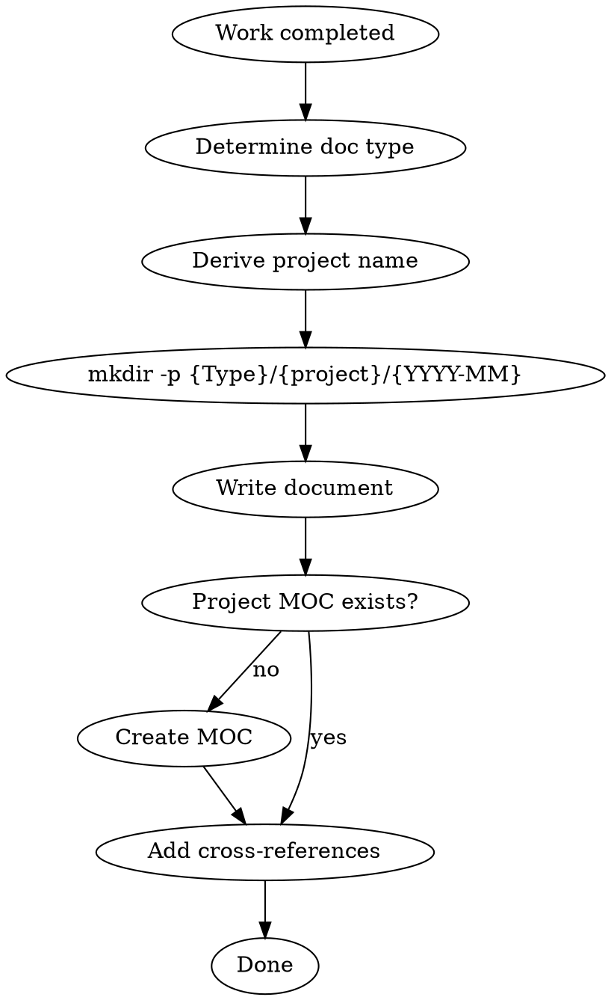

# Obsidian Documentation

Structurally document all Claude Code work into the Obsidian `Code-Notizbuch` vault.

## Vault Path

```
/Users/moyu/Library/CloudStorage/GoogleDrive-<email>/マイドライブ/Obsidian/Code-Notizbuch
```

**Write files directly** to this path using the Write tool. Obsidian auto-detects filesystem changes.

## When to Document

| Trigger | Doc Type | Top Folder |
|---------|----------|------------|
| Session ends or significant milestone | Session | `Sessions/` |
| Architecture/design choice made | Decision | `Decisions/` |
| Feature implemented or major progress | Feature | `Features/` |
| Bug investigated and/or fixed | Bug | `Bugs/` |
| Research completed on topic | Research | `Research/` |

## Directory Hierarchy

**3階層構造**: `{Type}/{project}/{YYYY-MM}/filename.md`

```
Code-Notizbuch/
├── Sessions/
│   ├── claude-code-config/
│   │   ├── 2026-03/
│   │   │   ├── 2026-03-28-obsidian-doc-skill-creation.md
│   │   │   └── 2026-03-28-claude-md-refactoring.md
│   │   └── 2026-04/
│   │       └── ...
│   └── my-project/
│       └── 2026-03/
│           └── ...
├── Decisions/
│   ├── claude-code-config/
│   │   └── 2026-03/
│   │       └── 2026-03-28-vault-structure.md
│   └── admin-dashboard/
│       └── ...
├── Features/
│   └── {project}/{YYYY-MM}/...
├── Bugs/
│   └── {project}/{YYYY-MM}/...
├── Research/
│   └── {project}/{YYYY-MM}/...
├── Index/
│   ├── Dashboard.md
│   └── Projects/
│       ├── claude-code-config.md    ← プロジェクト MOC
│       └── my-project.md
└── Templates/
```

### プロジェクト名の導出

`project` は以下の優先順で決定:
1. Git remote の repo 名 (`git remote get-url origin` → `owner/repo` → `repo`)
2. `package.json` の `name` フィールド
3. カレントディレクトリ名

**命名規則**: kebab-case（例: `admin-dashboard`, `claude-code-config`）

### ディレクトリ自動作成

書き込み前に `mkdir -p` でディレクトリを作成すること:
```bash
mkdir -p "${VAULT}/Sessions/${project}/${YYYY-MM}"
```

## Document Naming

**Format**: `YYYY-MM-DD-kebab-case-title.md`

Examples:
- `Sessions/claude-code-config/2026-03/2026-03-28-obsidian-doc-skill.md`
- `Decisions/admin-dashboard/2026-03/2026-03-28-auth-strategy.md`
- `Features/my-project/2026-04/2026-04-01-vector-search.md`
- `Bugs/my-project/2026-03/2026-03-28-token-expiry.md`

## Required Frontmatter

Every document MUST have YAML frontmatter:

```yaml
---
type: session | decision | feature | bug | research
date: "YYYY-MM-DD"
project: "project-name"
tags:
  - type-tag
  - project-tag
  - domain-tags
status: in-progress | completed | accepted | resolved
---
```

**Rules**:
- `project`: derive using the rules above (git remote → package.json → directory name)
- `tags`: always include the document type + project name + relevant domain tags
- `status`: reflect current state accurately

## Project MOC (Map of Content)

各プロジェクトに MOC ファイルを作成・更新する: `Index/Projects/{project}.md`

```yaml
---
type: project-moc
project: "project-name"
tags:
  - moc
  - project-name
---
```

```markdown
# Project: {project-name}

## Overview
プロジェクトの概要を1-2行で。

## Sessions
\```dataview
TABLE date, status
FROM "Sessions/{project}"
SORT date DESC
\```

## Decisions
\```dataview
TABLE date, status
FROM "Decisions/{project}"
SORT date DESC
\```

## Features
\```dataview
TABLE date, status
FROM "Features/{project}"
SORT date DESC
\```

## Bugs
\```dataview
TABLE date, status, severity
FROM "Bugs/{project}"
WHERE status != "resolved"
SORT date DESC
\```

## Research
\```dataview
TABLE date
FROM "Research/{project}"
SORT date DESC
\```
```

**MOC 更新ルール**: 新しいプロジェクトに初めてドキュメントを書く際に MOC を作成。Overview は初回作成時に記述し、以降は Dataview が自動集約するため手動更新不要。

## Cross-Referencing

Use Obsidian wikilinks to connect related notes:

```markdown
## Related
- [[2026-03-28-session-auth-refactor]] - Session where this decision was made
- [[2026-03-25-feature-jwt-auth]] - Related feature implementation
- [[admin-dashboard]] - Project MOC
```

**Link aggressively**: Every doc should link to at least one related doc + プロジェクト MOC。

## Content Structure by Type

### Session Log
```markdown
# Session: YYYY-MM-DD - Project Name

## Goal
One-line objective for this session.

## Work Done
- Bullet list of completed items with file paths
- Include commit hashes where relevant

## Decisions Made
- Key choices and rationale (link to Decision docs if significant)

## Files Modified
- `path/to/file.ts` - What changed and why

## Issues Encountered
- Problems hit and how resolved

## Next Steps
- [ ] Actionable items for future sessions
```

### Decision Record (ADR)
```markdown
# ADR: Title

## Context
Why this decision was needed.

## Options Considered
### Option A / Option B with pros/cons

## Decision
What was chosen.

## Rationale
Why this option won.

## Consequences
What this means going forward.
```

### Feature / Bug / Research
Follow templates in `Templates/` folder. Keep focused and actionable.

## Workflow Integration



### Opening in Obsidian (optional)
After writing, open the note:
```bash
open "obsidian://open?vault=Code-Notizbuch&file=Sessions/project-name/2026-03/2026-03-28-example"
```

## Quick Reference

| Item | Value |
|------|-------|
| Vault | `Code-Notizbuch` |
| Hierarchy | `{Type}/{project}/{YYYY-MM}/{filename}.md` |
| Write method | `mkdir -p` then Write tool |
| Open method | `open "obsidian://open?vault=Code-Notizbuch&file=path"` |
| Naming | `YYYY-MM-DD-kebab-case-title.md` |
| Project name | git remote → package.json → dir name (kebab-case) |
| Project MOC | `Index/Projects/{project}.md` |
| Frontmatter | Required: type, date, project, tags, status |
| Cross-refs | `[[wikilink]]` format + project MOC link |
| Dashboard | `Index/Dashboard.md` (Dataview queries) |

## Common Mistakes

- **Forgetting frontmatter**: Every doc needs YAML frontmatter for Dataview queries
- **No cross-references**: Always link related notes + project MOC
- **Vague titles**: Use descriptive kebab-case names, not `session-1.md`
- **Missing project tag**: Always derive and include the project name
- **Flat file placement**: NEVER put files directly under `Sessions/` etc. Always use `{project}/{YYYY-MM}/` hierarchy
- **Skipping MOC creation**: First doc for a new project must create the project MOC
- **Skipping mkdir**: Always `mkdir -p` before writing to ensure directory exists
- **Writing to wrong path**: Always use the full vault path, not relative
