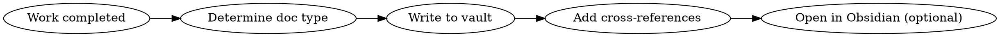

# Obsidian Documentation

Structurally document all Claude Code work into the Obsidian `Code-Notizbuch` vault.

## Vault Path

```
/Users/moyu/Library/CloudStorage/GoogleDrive-<email>/マイドライブ/Obsidian/Code-Notizbuch
```

**Write files directly** to this path using the Write tool. Obsidian auto-detects filesystem changes.

## When to Document

| Trigger | Doc Type | Folder |
|---------|----------|--------|
| Session ends or significant milestone | Session | `Sessions/` |
| Architecture/design choice made | Decision | `Decisions/` |
| Feature implemented or major progress | Feature | `Features/` |
| Bug investigated and/or fixed | Bug | `Bugs/` |
| Research completed on topic | Research | `Research/` |

## Document Naming

**Format**: `YYYY-MM-DD-kebab-case-title.md`

Examples:
- `Sessions/2026-03-28-claude-code-obsidian-skill.md`
- `Decisions/2026-03-28-vault-folder-structure.md`
- `Features/2026-03-28-obsidian-doc-skill.md`
- `Bugs/2026-03-28-auth-token-expiry.md`

## Required Frontmatter

Every document MUST have YAML frontmatter:

```yaml
---
type: session | decision | feature | bug | research
date: "YYYY-MM-DD"
project: "project-name"
tags:
  - type-tag
  - project-tag
  - domain-tags
status: in-progress | completed | accepted | resolved
---
```

**Rules**:
- `project`: derive from current working directory name or git remote
- `tags`: always include the document type + project name + relevant domain tags
- `status`: reflect current state accurately

## Cross-Referencing

Use Obsidian wikilinks to connect related notes:

```markdown
## Related
- [[2026-03-28-session-auth-refactor]] - Session where this decision was made
- [[2026-03-25-feature-jwt-auth]] - Related feature implementation
```

**Link aggressively**: Every doc should link to at least one related doc when possible.

## Content Structure by Type

### Session Log
```markdown
# Session: YYYY-MM-DD - Project Name

## Goal
One-line objective for this session.

## Work Done
- Bullet list of completed items with file paths
- Include commit hashes where relevant

## Decisions Made
- Key choices and rationale (link to Decision docs if significant)

## Files Modified
- `path/to/file.ts` - What changed and why

## Issues Encountered
- Problems hit and how resolved

## Next Steps
- [ ] Actionable items for future sessions
```

### Decision Record (ADR)
```markdown
# ADR: Title

## Context
Why this decision was needed.

## Options Considered
### Option A / Option B with pros/cons

## Decision
What was chosen.

## Rationale
Why this option won.

## Consequences
What this means going forward.
```

### Feature / Bug / Research
Follow templates in `Templates/` folder. Keep focused and actionable.

## Workflow Integration



### Opening in Obsidian (optional)
After writing, open the note:
```bash
open "obsidian://open?vault=Code-Notizbuch&file=Sessions/2026-03-28-example"
```

## Quick Reference

| Item | Value |
|------|-------|
| Vault | `Code-Notizbuch` |
| Write method | Direct file write via Write tool |
| Open method | `open "obsidian://open?vault=Code-Notizbuch&file=path"` |
| Naming | `YYYY-MM-DD-kebab-case-title.md` |
| Frontmatter | Required: type, date, project, tags, status |
| Cross-refs | `[[wikilink]]` format |
| Dashboard | `Index/Dashboard.md` (Dataview queries) |

## Common Mistakes

- **Forgetting frontmatter**: Every doc needs YAML frontmatter for Dataview queries
- **No cross-references**: Always link related notes
- **Vague titles**: Use descriptive kebab-case names, not `session-1.md`
- **Missing project tag**: Always derive and include the project name
- **Skipping documentation**: Document even "small" work - it compounds
- **Writing to wrong path**: Always use the full vault path, not relative
