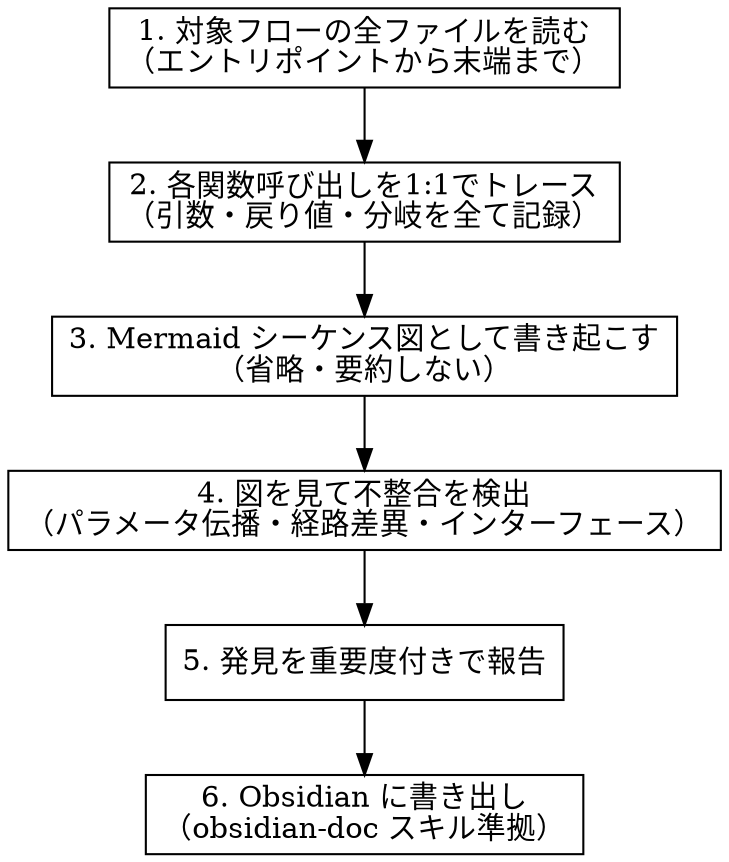

# Sequence Diagram Verification

コードを1:1でシーケンス図に書き起こし、通常レビューでは見つからない潜在バグを炙り出すテクニック。

## Why This Works

通常のコードレビューは「既知の悪いパターン」を探すパターンマッチング。シーケンス図への書き起こしは「実際の挙動を再構築する」認知モード。この切り替えが以下を可視化する:

- **パラメータ未伝播**: 引数を追加したが下流で無視されている
- **経路間不整合**: ストリーミング/非ストリーミングで異なるデフォルト値
- **インターフェース乖離**: 実装は変更したがインターフェース定義が未更新
- **クロージャ・スコープ問題**: ループ内定義の遅延バインディングリスク
- **デッドコードパス**: 到達不能だが存在する不整合な処理

## When to Use

- コードレビュー完了後、追加検証として
- 3層以上のレイヤーをまたぐ処理フロー（API → Service → Repository → External）
- パラメータが多段で受け渡される箇所
- ストリーミング/非ストリーミング等の複数経路が存在する処理
- PR で新しい引数やフィールドを追加した直後

## When NOT to Use

- 単一ファイル内で完結する変更
- UI のスタイリングのみの変更
- 設定値の変更のみ

## Process



### Step 1: 全経路の読み取り

エントリポイント（API endpoint / UI event handler）から始めて、呼び出し先を末端まで追う。

**必須確認ポイント:**
- 各関数のシグネチャ（引数名・型・デフォルト値）
- 条件分岐の全ブランチ
- 例外ハンドリングの経路
- 非同期処理の合流点

### Step 2: 1:1 トレース

**鉄則: コードに書いてあることだけを書く。推測・補完しない。**

各呼び出しで以下を記録:
- 渡される引数（値がどこから来るか）
- 返される値（呼び出し元でどう使われるか）
- 副作用（DB書き込み、外部API呼び出し、状態変更）

### Step 3: Mermaid シーケンス図作成

```markdown
sequenceDiagram
    participant Client
    participant API
    participant Service
    participant Repository

    Client->>API: POST /endpoint (param_a, param_b)
    API->>Service: process(param_a, param_b)
    Note right of Service: param_b はここで使われない（潜在バグ）
    Service->>Repository: save(param_a)
    Repository-->>Service: result
    Service-->>API: response
    API-->>Client: 200 OK
```

**図の粒度:**
- 関数呼び出しごとに1本の矢印
- 引数は括弧内に列挙
- 分岐は `alt` / `opt` ブロックで表現
- 使われないパラメータには `Note` で明示

### Step 4: 不整合検出チェックリスト

図を完成させた後、以下を体系的に確認:

| チェック項目 | 確認内容 |
|-------------|---------|
| パラメータ伝播 | 上流で追加された引数が下流で実際に使われているか |
| 経路間一貫性 | 複数経路（streaming/non-streaming等）で同じパラメータ・デフォルト値か |
| インターフェース整合 | 実装とインターフェース定義（abstract class, protocol）が一致するか |
| 戻り値の利用 | 返された値が呼び出し元で無視されていないか |
| エラーハンドリング | catch が空（`catch(() => {})`）になっていないか |
| スコープ問題 | ループ内クロージャ、遅延バインディングのリスクはないか |

### Step 5: 報告フォーマット

発見を重要度付きで報告する:

- **Critical**: 正常動作しない、データ損失の可能性
- **Medium**: 意図した機能が部分的に動作しない
- **Low**: 現状は問題ないが、リファクタリング時にリスク

各発見には「何が起きているか」「なぜ問題か」「影響範囲」を含める。

### Step 6: Obsidian 書き出し

`obsidian-doc` スキルに準拠して書き出す。type は状況に応じて `research` または `feature` を選択。

## Common Mistakes

- **図を要約してしまう**: 「Service が処理する」ではなく、具体的にどの関数をどの引数で呼ぶか書く
- **正常系だけ書く**: エラー系・分岐系も全て含める
- **レビューと混同する**: これはレビューの代替ではなく、レビュー後の追加検証フェーズ
- **発見を修正と混同する**: まず全体像を書き起こしてから問題を指摘する。書きながら修正しない
